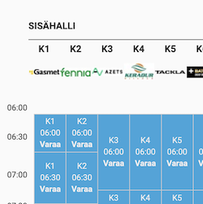

<!-- PROJECT SHIELDS
*** I'm using markdown "reference style" links for readability.
*** Reference links are enclosed in brackets [ ] instead of parentheses ( ).
*** See the bottom of this document for the declaration of the reference variables
*** This is an optional, concise syntax you may use.
*** https://www.markdownguide.org/basic-syntax/#reference-style-links
-->

<!-- HEADER -->

[![Python][python-shield]][python-url]
[![License][license-shield]][license-url]
[![LinkedIn][linkedin-shield]][linkedin-url]

# Helsinki tennis finder



_Finding empty slots for reservations in Helsinki region tennis centres_

## Motivation

- In certain periods (bad weather, winter time) it's very hard to reserve a time slot for indoors tennis in Helsinki region
- Since all three major tennis centres (Puhos, Tali, Smash) use similar reservation system (but do not provide any public API), it's possible to scrape the data
- The program queries all available tennis centres (Puhos, Tali, Smash) in Helsinki region and gives free dates and times within default preferred range (see constants), so that you could decide which one is a suitable slot to play

## How to use

- Just run the program with your Python interpreter from the command line
- The program **does not** provide any reservation capabilities nor any is planned for the nearest future

## Installation

1. Clone this repository:

```
$ git clone https://github.com/andrejkurusiov/tennis-finder-hel.git [your-folder-name]
```

2. _(optional)_\* Install [Python](https://www.python.org/downloads/)
3. Install packages with `pip`:

```
$ pip install -r requirements.txt
```

4. Run: `$ python filename.py`

(\*) _instead of installing Python locally, you can use online service, such as [Google Colab][google-colab-url]._

## Future development

- Async queries for the tennis centres' data
- Display default parameters
- Provide possibility to specify (command line) querying parameters
- Possibly establish notification service (unlikely)

## License

Distributed under the [MIT License](./LICENSE).

<!-- MARKDOWN LINKS & IMAGES -->
[license-shield]: https://img.shields.io/github/license/andrejkurusiov/python-jetbrains-academy
[license-url]: ./LICENSE
[linkedin-shield]: https://img.shields.io/badge/LinkedIn-Profile-informational?style=flat&logo=linkedin
[linkedin-url]: https://www.linkedin.com/in/andrejkurusiov/
[python-shield]: https://img.shields.io/badge/Python-545454.svg?style=flat&logo=python
[python-url]: https://python.org/
[google-colab-url]: https://colab.research.google.com/
